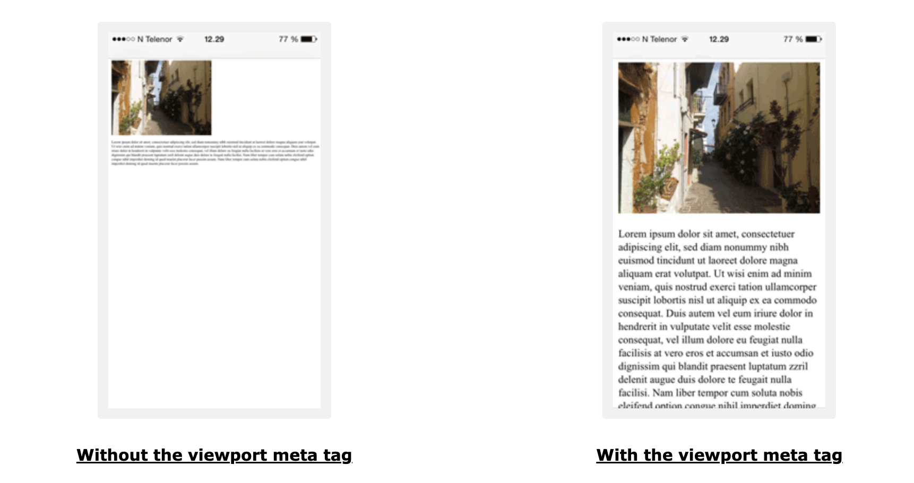
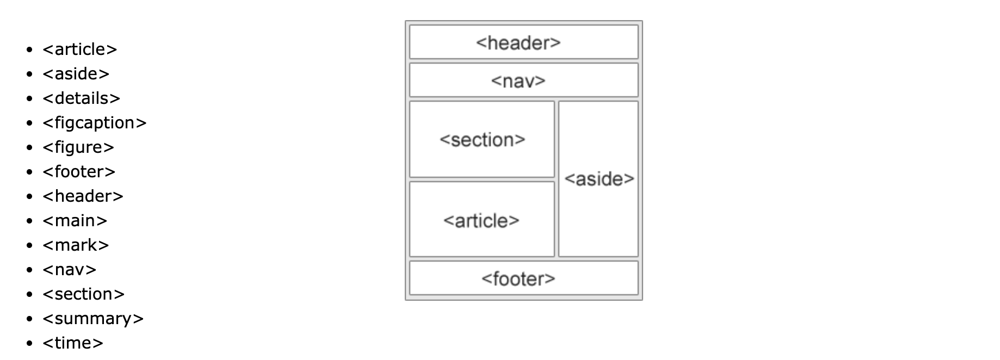

# Working on the basic boilerplate for the html page

## Working line by line and doing all the 3 sections we intend to do

1. The Left Section
2. The About Section
3. The Quiz Section

## Working in the head section of html first

### Adding meta tags and declaring doctype

```html
<!DOCTYPE html>
<html>
  <head>
    <meta charset="UTF-8">
    <meta http-equiv="X-UA-Compatible" content="IE=edge">
    <meta name="viewport" content="width=device-width, initial-scale=1.0">
  <head>
</html>
```

Meta tags are used to provide information about the document to the browser.

- Charset is used to specify the character encoding for the HTML document. UTF-8 is the most commonly used character encoding. 8-bit Unicode Transformation Format.
- X-UA-Compatible is used to specify the compatibility mode of the browser.like IE=edge, it is used to specify the latest version of IE.
- Viewport is used to specify the viewport of the browser.

> Viewport is the user's visible area of a web page. It varies with the device, and will be smaller on a mobile phone than on a computer screen.



### Delclairing a Title

```html
<head>
  <!-- ... -->
  <title>Quiz App</title>
</head>
```

Title is the content shown in the browser tab.

### Link stylesheets

As dicussed we have three sections so we have made three stylesheets in the `styles/` directory. Namely, `styles.css`, `about.css` and `quiz.css`.

```html
<head>
  <!-- ... -->
  <link rel="stylesheet" href="styles/styles.css" />
  <link rel="stylesheet" href="styles/about.css" />
  <link rel="stylesheet" href="styles/quiz.css" />
</head>
```

### Adding Google Fonts

We will be using Google Fonts for the fonts in our app. We will be using the `Poppins` font for the headings and `Roboto` for the body text.

```html
<head>
  <!-- ... -->
  <link rel="preconnect" href="https://fonts.googleapis.com" />
  <link rel="preconnect" href="https://fonts.gstatic.com" crossorigin />
  <link
    href="https://fonts.googleapis.com/css2?family=Inter:wght@100;200;300;400;500;600&family=Poppins:wght@100;200;300;600;700&display=swap"
    rel="stylesheet"
  />
</head>
```

These links are provided by Google Fonts, these fonts will be downloaded by the browser when the page loads.

## Working on the Sections

```html
<body>
  <section class="left"></section>
  <section class="about-section"></section>
  <section class="quiz-section"></section>
</body>
```

Following the HTML semantics, we use the `section` tag to define the sections of the page.

### Working on the Left Section

We have two subsections in it

1. A div with the title and the the logo
2. A form which will contain all the buttons and the input field

## Working on the Title and Logo

```html
<section class="left">
  <div class="left-heading-section">
    <h1 class="heading">
      IPL <br />
      Quizbot
    </h1>
    
  </div>
</section>
```

The heading section contains the heading and the logo. The heading is a `h1` tag with the class `heading`. The logo is an `img` tag with the class `gptlogo`.

> **Quick Question**
>
> - What is the diffrerence between a `div` and a `section` tag?
> - What is the diffence between a `class` and an `id`?

## Working on the form with the inputs

```html
<section class="left">
  <!-- ... -->

  <form id="quiz__generate__form">
    <h2>Choose your difficulty level</h2>
    <div class="difficulty-selector">
      <div class="difficulty-selector-button">
        <input type="radio" name="difficulty" id="easy" value="easy" checked />
        <label class="difflabel" for="easy">Easy</label>
      </div>
      <div class="difficulty-selector-button">
        <input type="radio" name="difficulty" id="medium" value="medium" />
        <label class="difflabel" for="medium">Medium</label>
      </div>
      <div class="difficulty-selector-button">
        <input type="radio" name="difficulty" id="hard" value="hard" />
        <label class="difflabel" for="hard">Hard</label>
      </div>
    </div>

    <button type="submit" class="generate-quiz purple-gradient">
      GENERATE QUIZ
    </button>
  </form>
</section>
```

> ### Quick Question
>
> Why did we use radio buttons instead of checkboxes?

## Working on the About section

```html
<section class="about-section">
  <article class="about-section-article">
    <h2 class="about-section-heading">About</h2>
    <p class="about-section-text">
      The AI-powered IPL quizbot is a web-based game designed to test your
      knowledge of the Indian Premier League. Created using CHATGPT, the quizbot
      generates IPL-based questions with multiple-choice answers, and features
      different levels of difficulty, real-time feedback.
    </p>
  </article>

  <article class="about-section-article">
    <h2 class="about-section-heading">Steps to Play</h2>
    <p class="about-section-text">
      Step 1: Select the level of the game you want to play - easy, medium, or
      difficult.
    </p>
    <p class="about-section-text">
      Step 2: Click on the "Generate" button to start the game. The quizbot will
      generate an IPL-based question with multiple-choice answers.
    </p>
    <p class="about-section-text">
      Step 3: Select the answer you think is correct and click on "Submit".
    </p>
    <p class="about-section-text">
      Step 4: The quizbot will tell if your answer is correct or not.
    </p>
  </article>
</section>
```

> **Question**
>
> What is the difference between `article` and `section` tags?
>
> The `article` element specifies independent, self-contained content.The `section` element defines section in a document.



## Working on the Quiz section

It will contain the question with options( again a radio button), and a next button

---

```html
<section class="quiz-section">
  <form id="quiz__section">
    <div class="quiz-section-display">
      <h2>
        <span id="quiz__question__content">
          Who is the captain of the Mumbai Indians?
        </span>
      </h2>

      <!-- options -->
      <div id="quiz__section__options">
        <div class="option">
          <input type="radio" name="answer" id="answer1" value="0" />
          <label for="answer1"></label>
        </div>

        <div class="option">
          <input type="radio" name="answer" id="answer2" value="1" />
          <label for="answer2"></label>
        </div>

        <div class="option">
          <input type="radio" name="answer" id="answer3" value="2" />
          <label for="answer3"></label>
        </div>

        <div class="option">
          <input type="radio" name="answer" id="answer4" value="3" />
          <label for="answer4"></label>
        </div>
      </div>
    </div>
    <button id="quiz__next__btn" type="submit">Next</button>
  </form>

  <div id="quiz__scorecard"></div>
</section>
```

## Last but not the least for html, adding the script tag to link our js file

---

```html
<script src="./scripts/quiz.js"></script>
<script src="./scripts/main.js"></script>
```

Script tags are added at the last before the body ends to load the js files after the html is loaded.

## Ending the body and html tags

---

```html
  </body>
</html>
```
