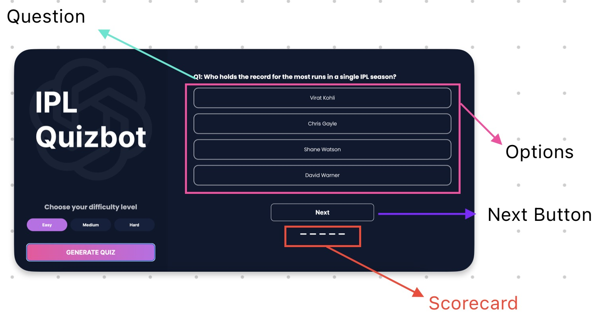

# Quiz Class
To handle all the logic in the quiz section, like going to the next question, checking the answer for the current question, updating the scoreboard after each question etc.

## Classes in Javascript
In Javascript, classes are defined using the `class` keyword. The constructor is a special method that is called when an object is created. It is used to initialize the object. The constructor is called automatically wh

```js
class Quiz {
    constructor() {
        // code
    }

    renderQuestion() { // method
        // renders the question
    }

    renderScoreCard() {
        // updates the score card
    }

    handleNextQuestion() {
        // checks the answer for the current question
        // goes to the next question
    }
}
```

Let's look at the shape of the data returned from the API:

```json
[
    {
        "question": "Q1: Who holds the record for the most runs in a single IPL season?",
        "options": [
            "Virat Kohli",
            "Chris Gayle",
            "Shane Watson",
            "David Warner"
        ],
        "answer": "1"
    },
    ...
]
```

Question comes with the numbering (Q1, Q2, Q3 etc.) in the API.(Thanks to gpt). This reduces the complexity, Now we don't need to maintain a counter of our own.

The `answer` property has the index (0-based) of the correct question.

Keep the shape in mind. Now let's look at the UI of the quiz section.



let's select all the elements we need to manipulate in the quiz section.

```js
const quizSection = document.querySelector("#quiz__section");
const quizQuestion = document.querySelector("#quiz__question__content");
const quizOptions = document.querySelectorAll(
  "#quiz__section__options .option > label"
);
const quizNextBtn = document.querySelector("#quiz__next__btn");
const quizScorecard = document.querySelector("#quiz__scorecard");
```

Let's populate the methods in the `Quiz` class, starting with the constructor.

```js
class Quiz {
    constructor({
        questions,
        quizQuestion,
        quizOptions,
        quizNextBtn,
        quizSection,
        quizScorecard,
        correctAnswer,
        wrongAnswer,
        blank,
    }) {
        this.questions = questions || [];
        this.currentQuestion = 0;
        this.scoreCard = [];

        for (let i = 0; i < this.questions.length; i++) {
        this.scoreCard.push(null);
        }

        this.quizQuestion = quizQuestion;
        this.quizOptions = quizOptions;
        this.quizNextBtn = quizNextBtn;
        this.quizSection = quizSection;
        this.quizScorecard = quizScorecard;


        this.correctAnswer = correctAnswer;
        this.wrongAnswer = wrongAnswer;
        this.blank = blank;
    }
}
```

We defined the constructor, and set all the properties we need to manipulate in the quiz section.

Scorecard is an array of `null` with length equal to the number of questions. We will update the scorecard after each question.

| value | meaning |
| --- | --- |
| `null` | unanswered |
| `true` | correct |
| `false` | incorrect |


> ## Side Notes:
>
>-  The `||` operator is used to provide a default value in case the value is `undefined` or `null`.
>
>-  We don't have named parameters in Javascript. So we are using an object to pass the parameters.
>
>-  We pass HTML elements in the constructor, so that we don't have to query the DOM every time we need to manipulate them.
>
---

Now we need to render the current question and options. We will use the `renderQuestion` method for this.

```js
class Quiz {
    // ...
    renderQuestion() {
        let questionNum = this.currentQuestion;
        const question = this.questions[questionNum];
        this.quizQuestion.textContent = question.question;

        for (let i = 0; i < this.quizOptions.length; i++) {
            quizOptions[i].textContent = question.options[i];
        }
    }
    // ...
}
```

---

Now we need to render the scorecard. We will use the `renderScoreCard` method for this.

```js
class Quiz {
    // ...

    renderScoreCard() {
        this.quizScorecard.innerHTML = "";

        for (let i = 0; i < this.scoreCard.length; i++) {
        const score = this.scoreCard[i];

        if (score === null) {
            this.quizScorecard.innerHTML += this.blank;
        } else if (score) {
            this.quizScorecard.innerHTML += this.correctAnswer;
        } else {
            this.quizScorecard.innerHTML += this.wrongAnswer;
        }
        }
    }

    // ...
}
```

---

Let's add these methods in the constructor to render the first question and scorecard.

```js
class Quiz {
    constructor({
        questions,
        quizQuestion,
        quizOptions,
        quizNextBtn,
        quizSection,
        quizScorecard,
        correctAnswer,
        wrongAnswer,
        blank,
    }) {
        this.questions = questions || [];
        this.currentQuestion = 0;
        this.scoreCard = [];

        for (let i = 0; i < this.questions.length; i++) {
        this.scoreCard.push(null);
        }

        this.quizQuestion = quizQuestion;
        this.quizOptions = quizOptions;
        this.quizNextBtn = quizNextBtn;
        this.quizSection = quizSection;
        this.quizScorecard = quizScorecard;

        this.correctAnswer = correctAnswer;
        this.wrongAnswer = wrongAnswer;
        this.blank = blank;

        this.renderQuestion();
        this.renderScoreCard();
    }

    // ...
}
```
---
We are almost done with the `Quiz` class. Now we need to handle the next question button. We will use the `handleNextQuestion` method for this.

```js
class Quiz {
    // ...

    handleNextQuestion() {

        // first check if currentQuestion < totalQuestions
        if (this.currentQuestion >= this.questions.length) {
            return; // No need to go to the next question
        }

        const selectedOptionElement = this.quizSection.querySelector(
            'input[name="answer"]:checked'
        );

        if (!selectedOptionElement) {
            return; // No option is selected
        }

        if (selectedOption == this.questions[this.currentQuestion].answer) {
            this.scoreCard[this.currentQuestion] = true;
        } else {
            this.scoreCard[this.currentQuestion] = false;
        }

        this.renderScoreCard();

        this.currentQuestion += 1;

        if (this.currentQuestion < this.questions.length) {
            this.renderQuestion();
        }

        selectedOptionElement.checked = false;
    }
}
```

---

Now we need to add the event listener to the next question button. We want to add the event listener once the DOM is loaded. Let's do it in the `main.js` file.

```js

quizSection.addEventListener("submit", (e) => {
  e.preventDefault();
  if (!quiz) return;
  quiz.handleNextQuestion();
});

```

---

Congratulations! 🎉🎉🎉
We have completed the `Quiz` class.
